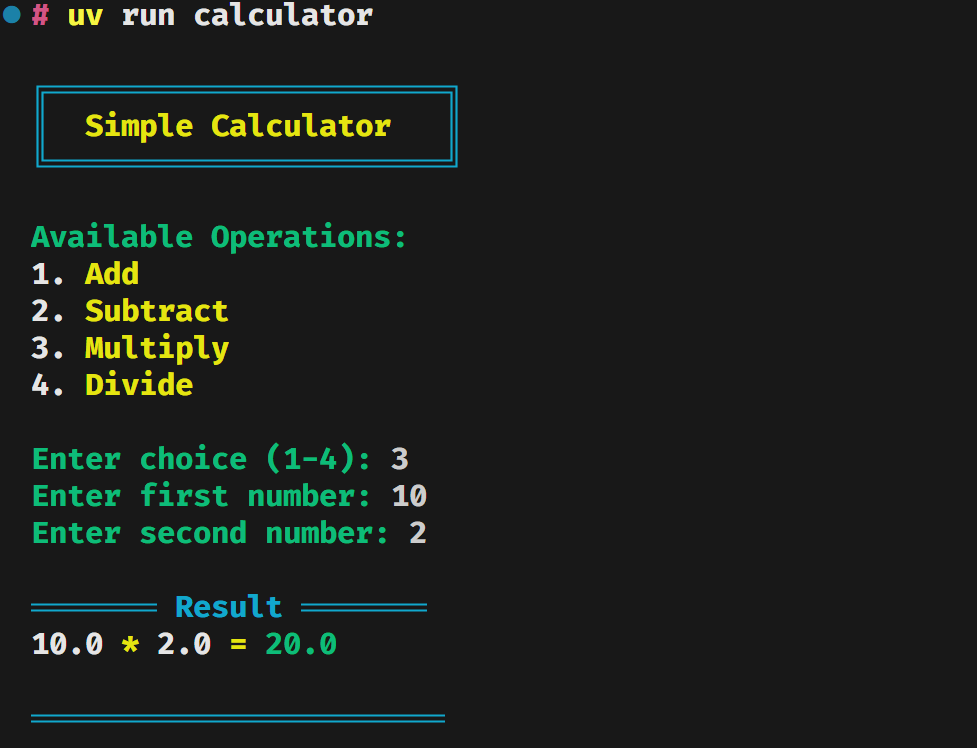

# Simple Calculator

A beautiful command-line calculator with colorful interface built in Python.



## Features

- 🎨 Beautiful colorful interface
- ➕ Basic arithmetic operations:
  - Addition
  - Subtraction
  - Multiplication
  - Division
- ⚡ Input validation and error handling
- 🔄 Continuous operation mode
- 🐛 Comprehensive test suite

## Installation

This project uses [uv](https://github.com/astral-sh/uv) as the package manager. Make sure you have it installed.

```bash
# Clone the repository
git clone https://github.com/MuhammadRaffey/calculator-with-Cursor-Composer.git
cd calculator-with-Cursor-Composer

# Install dependencies
uv venv
source .venv/bin/activate  # On Windows: .venv\Scripts\activate
uv sync
```

## Usage

After installation, you can run the calculator :

1. Using the installed script:

```bash
uv run calculator
```

Follow the on-screen prompts to:

1. Select an operation (1-4)
2. Enter the first number
3. Enter the second number

The result will be displayed with a colorful interface.

## Development

### Setting up the development environment

```bash
uv sync"
```

```
calculator-with-Cursor-Composer/
├── src/
│   └── calculator/
│       ├── __init__.py
│       ├── main.py        # CLI interface
│       └── calculator.py  # Core calculator logic
├── pyproject.toml
└── README.md
```

## Error Handling

The calculator includes robust error handling for:

- Invalid operation selection
- Invalid number inputs
- Division by zero
- Unexpected errors

## Contributing

1. Fork the repository
2. Create your feature branch (`git checkout -b feature/amazing-feature`)
3. Commit your changes (`git commit -m 'Add some amazing feature'`)
4. Push to the branch (`git push origin feature/amazing-feature`)
5. Open a Pull Request

## License

This project is licensed under the MIT License - see the [LICENSE](LICENSE) file for details.

## Acknowledgments

- [Colorama](https://pypi.org/project/colorama/) for cross-platform colored terminal output
